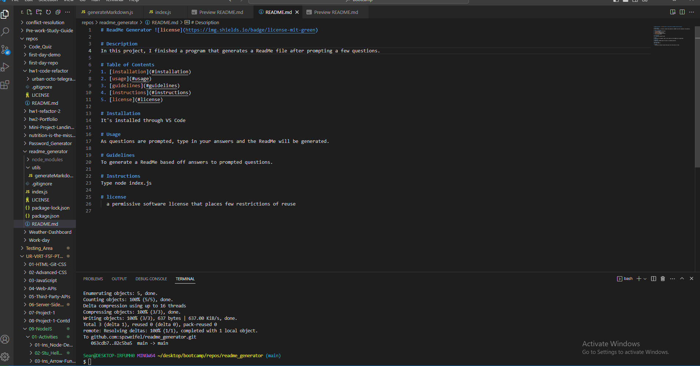

# ReadMe Generator 

# Description 
In this project, I finished a program that generates a ReadMe file after prompting a few questions.

# Table of Contents
1. [installation](#installation)
2. [usage](#usage)
3. [guidelines](#guidelines)
4. [instructions](#instructions)
5. [license](#license)

# Installation
It's installed through VS Code

# Usage 
As questions are prompted, type in your answers and the ReadMe will be generated.

# Guidelines 
To generate a ReadMe based off answers to prompted questions.

# Instructions 
Type node index.js

# license
  a permissive software license that places few restrictions of reuse

# Screenshot

